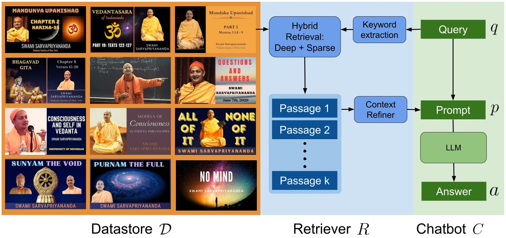

# VedantaNY-10M
This repository contains the source code for the paper [Ancient Wisdom, Modern Tools: Exploring Retrieval-Augmented LLMs for Ancient Indian Philosophy](https://sites.google.com/view/vedantany-10m).

**Outstanding Paper** at [*Machine Learning for Ancient Languages (ACL Workshop), 2024*](https://www.ml4al.com/index.html)


## Citing this work
If you find this work useful in your research, please consider citing:
```
@inproceedings{mandikal2024vedantany10m,
  title = "Ancient Wisdom, Modern Tools: Exploring Retrieval-Augmented {LLM}s for {A}ncient {I}ndian Philosophy",
  author = "Mandikal, Priyanka",
  booktitle = "Proceedings of the 1st Workshop on Machine Learning for Ancient Languages (ML4AL 2024)",
  year = "2024",
  publisher = "Association for Computational Linguistics",
}
```

## Overview
LLMs have revolutionized the landscape of information retrieval and knowledge dissemination. However, their application in specialized areas is often hindered by factual inaccuracies and hallucinations, especially in long-tail knowledge distributions. We explore the potential of retrieval-augmented generation (RAG) models for long-form question answering (LFQA) in a specialized knowledge domain. We present VedantaNY-10M, a dataset curated from extensive public discourses on the ancient Indian philosophy of Advaita Vedanta. We develop and benchmark a RAG model against a standard, non-RAG LLM, focusing on transcription, retrieval, and generation performance. Human evaluations by computational linguists and domain experts show that the RAG model significantly outperforms the standard model in producing factual and comprehensive responses having fewer hallucinations. In addition, a keyword-based hybrid retriever that emphasizes unique low-frequency terms further improves results. Our study provides insights into effectively integrating modern large language models with ancient knowledge systems.




## Dataset

We use transcripts for 612 lectures on the Indian philosophy of Advaita Vedanta from the [Vedanta Society of New York (VSNY)](vedantany.org). They are automatically generated from the [OpenAI Whisper](https://github.com/openai/whisper) large-v2 model.

Code for generating transcripts is provided in the `transcription` folder. Please follow the steps below:
1. **Download audio:** You can either generate transcripts for all videos on VSNY's YouTube channel up to the current date or use the videos used in the paper (up to March 24th 2024). The list of videos used is provided in [bot.csv](https://drive.google.com/drive/folders/1IIn9LgfQVxahKZriTXWG66UjtGn99Nns). Download the csv file and place it in `data/metadata/large-v2/episodes`.
    - Download audio files using the list used in the paper:
        ```shell
        python transcription/download_audio.py --download-from-csv --csv-file bot.csv
        ```
    - Alternately, download all audio files from VSNY up to the current date:
        ```shell
        python transcription/download_audio.py
        ```
    - To update the list from time-to-time, you can use the `--skip-saved` flag:
        ```shell
        python transcription/download_audio.py --skip-saved
        ```

2. **Split audio:** Based on available resources, split the metadata into chunks that can be processed in parallel.
    - Single machine: number of chunks is 1 by default (n=1)
        ```shell
        python split_audio.py
        ```
    - Multiple GPUs and/or machines: Set n as per your requirement
        ```shell
        python split_audio.py --n 8
        ```

3. **Generate transcripts:** 
    - To run on a single machine, you can run the following command:
        ```shell
        python transcription/run_whisper.py
        ```
    - To run in parallel, please edit `scripts/run_whisper.sh` as per your requirements and run as:
        ```shell
        bash scripts/run_whisper.sh
        ```

Once the transcription is complete, the `data` folder should contain all the transcript data to be chunked, embedded and stored in the vectordb.

## Setup

#### Conda environment
1. Create a conda environment called 'vedantany10m':

    ```shell
    conda create -n vedantany10m python=3.10
    conda activate vedantany10m
    ```

2. Install required packages:
    ```shell
    pip install -r requirements.txt 
    ```

3. Install spacy models
    ```shell
    python -m spacy download en_core_web_sm
    python -m spacy download en_core_web_lg
    ```

#### Verify installation
Make sure that you are able to import the following packages in python without any errors:
```shell
import torch
from transformers import AutoModelForCausalLM, AutoTokenizer
from langchain.text_splitter import RecursiveCharacterTextSplitter
from utils.tfidf_retriever import CustomTFIDFRetriever
from utils.ensemble_retriever import CustomEnsembleRetriever
```

#### OpenAI & Pinecone API keys (optional)
*Note: If you plan to use an open-source embedder (Nomic), LLM (Mixtral) and VectorDB (ChromaDB), you can skip this section.*

1. **OpenAI**: If you want to use OpenAI models such as ada for embedding chunks or GPT for the LLM, you have to open an account and obtain API keys. Please follow the steps below:
    - Setup an OpenAI developer account [here](https://platform.openai.com/)
    - Get your API key
    - Add it to bashrc as follows:
        - `export OPENAI_API_KEY=<enter-api-key>`

2. **Pinecone**: If you want to use Pinecone as the vectorDB, you'll again need API keys. Please follow the steps below:
    - Setup a pinecone account [here](https://www.pinecone.io/)
     - Get your API key
    - Add it to bashrc as follows:
        - `export PINECONE_API_KEY=<enter-api-key>`
    - Also set the environment e.g. us-west1-gcp-free
        - `export PINECONE_ENV=<enter-env>`
    - After all additions, source the bash file:
        - `source ~/.bashrc`

## Run Bot

1. **Chunk transcripts** 
    - This splits each transcript into multiple passages
        - `python create_chunks.py --whisper_model large-v2`
    <br>

2. **Embed chunks**: Use an embedding model and vectorDB of your choice. There are options to use closed source embedders and databases (OpenAI ada embdding, Pinecone vectorDB) or open source (Nomic embedding, ChromaDB). You can run any of the following as per your chice:
    - Nomic embedding and ChromaDB: 
        - `python embed_chunks.py --embedding_model nomic --vectorstore chroma`
    - Openai embedding and ChromaDB: 
        - `python embed_chunks.py --embedding_model openai --vectorstore chroma`
    - Openai embedding and Pinecone: 
        - `python embed_chunks.py --embedding_model openai --vectorstore pinecone`
    <br>

3. **Run chatbot**
    - We provide options to run open or closed LLMs of your choice. While OpenAI's GPTs are closed, Mixtral is open-source and can be run natively on your local machine. Run any of the following according to the model and embedding of choice:
        ```shell
        python test_bot.py --llm gpt-4 --embedding_model openai --vectorstore pinecone
        python test_bot.py --llm gpt-3.5-turbo --embedding_model openai --vectorstore pinecone
        python test_bot.py --llm gpt-3.5-turbo --embedding_model nomic --vectorstore chroma
        python test_bot.py --llm mixtral --embedding_model nomic --vectorstore chroma
        ```

    - To pass an input query at run time, use the `--pass-query` flag. Example:
        `python test_bot.py --llm mixtral --embedding_model nomic --vectorstore chroma --pass-query`


## Evaluation

The evaluation dataset comprising 25 queries across 5 categories is in `eval/2-rag-vs-kwrag/queries.xlsx`. Answers from different models are in `eval/2-rag-vs-kwrag/answers`.

### Human survey
We provide anonymized responses of our human survey. They contain numbered ratings for each LLM answer as well as long-form feedback.
- RAG vs Non-RAG
    - [All reviewers](https://docs.google.com/spreadsheets/d/1W22BuL8zr33K8TUQNvGI0DrKxFVYaXeH/pubhtml) 
- KW-RAG
    - [Reviewer 1](https://docs.google.com/spreadsheets/d/1t0pRlNldFu7mxzvtPJ5VRTAv1K8jqk1q/pubhtml)
    - [Reviewer 2](https://docs.google.com/spreadsheets/d/1mLfzi12juDVjKxs7vV4cEi6--xKxOeoz/pubhtml)
    - [Reviewer 3](https://docs.google.com/spreadsheets/d/1EoLwzVbbxGHRYg0GZzGlGvztMes_FgN7/pubhtml)
    


### Automatic metrics

We evaluate five automatic metrics as follows:
1. length: number of words and sentences (answer-only)
2. self_bleu: reported self-bleu-5 in colm (answer-only)
3. perplexity: gpt-2 (answer-only)
4. rank_gen: q as prefix, a as suffix (question-answer)
5. qafact_eval: run from qafacteval conda env (retrieval-answer)

To run the above automatic metrics reported in the paper, follow the steps below.

#### Installation

Install supporting repos for computing metrics:

1. RankGen
    - Clone repo
        ```shell
        git clone git@github.com:martiansideofthemoon/rankgen
        ```

2. QAFactEval
    - Clone repo and install packages
        ```shell
        conda create --name qafacteval python=3.10
        cenv qafacteval
        pip install qafacteval
        pip install gdown==4.6.0
        ```
    - Download models
        ```shell
        git clone git@github.com:salesforce/QAFactEval
        cd ../QAFactEval
        bash download_models.sh
        ```

#### Generate LLM responses (optional)
We already provide responses from different models in `eval/2-rag-vs-kwrag/answers`. If you want to generate them yourself, you can run the following scripts:
```shell
bash scripts/keyword_extraction.sh
bash scripts/mixtral_bot.sh
```
Generated answers are saved in `eval/2-rag-vs-kwrag/answers`

#### Run metrics
To obtain all the automatic metrics, please run the following script:
```shell
bash scripts/metrics.sh
```
Note: For QAFactEval, please run the commands in the qafacteval conda env.
Metrics are saved in the `eval/2-rag-vs-kwrag/metrics`

## Ethics Statement
- All data used in this project has been acquired from public lectures on [YouTube](https://www.youtube.com/channel/UCZOKv_xnTzyLD9RJmbBUV9Q) delivered by Swami Sarvapriyananda of the Vedanta Society of New York. These transcripts have not been proofread for accuracy. 
- While our study explores integrating ancient knowledge systems with modern machine learning techniques, we recognize their inherent limitations. Users of these tools need to be aware that these models can make errors, and should therefore seek guidance from qualified teachers to carefully progress on the path.